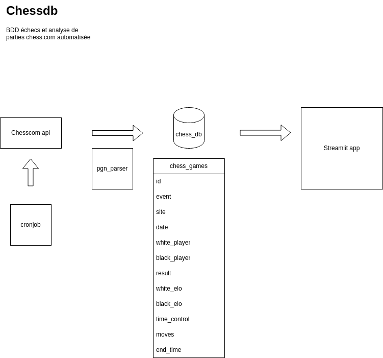
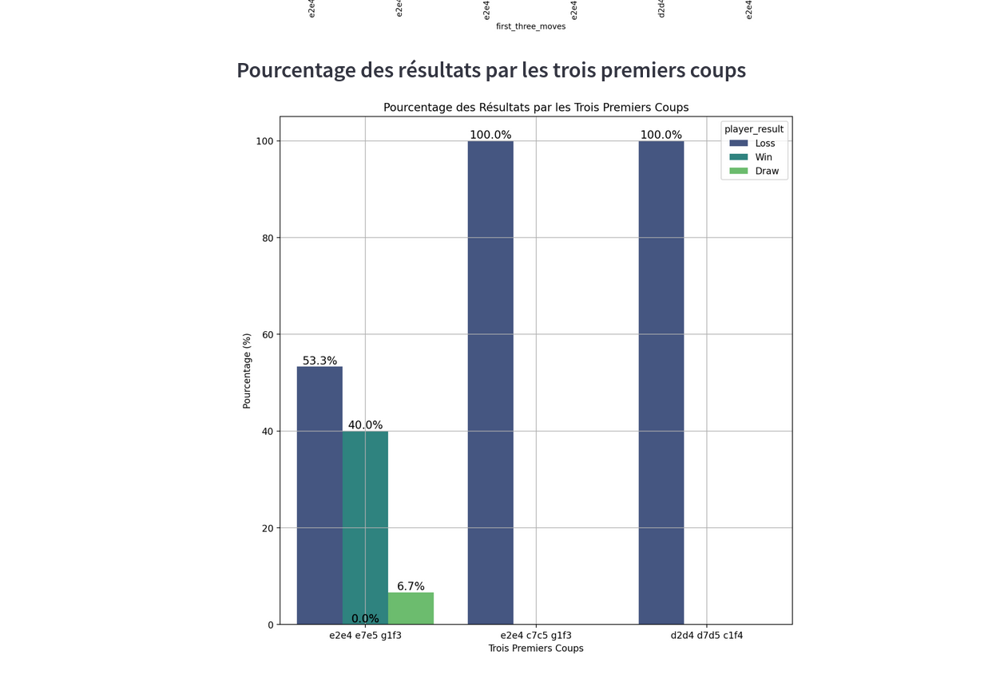

# Base de donnee et analyse de partie d'echecs issues de chesscom
# Analyse avec le module streamlit

## parser vos parties d'echecs .pgn pour en faire une bdd postgres
packages dans requirements.txt

mettre en place le fichier data
    games.pgn

mettre en place .env
    <ul>
    <li>DB_NAME=</li>
    <li>DB_USER=</li>
    <li>DB_PASSWORD=</li>
    <li>DB_HOST=localhost</li>
    <li>DB_PORT=5432</li>
    <li>PLAYER_NAME=pseudonyme</li>
    </ul>

# mise en place bdd postgress
CREATE DATABASE your_db_name;

-- Grant usage on schema public
GRANT USAGE ON SCHEMA public TO myuser;

-- Grant all privileges on the schema public
GRANT ALL PRIVILEGES ON SCHEMA public TO myuser;

-- If you need to grant all privileges on the database
GRANT ALL PRIVILEGES ON DATABASE mydatabase TO myuser;

# insertion de donnees et vues

python main.py : insertion des donnees
create_views : creer les vues des parties des 6 derniers mois
